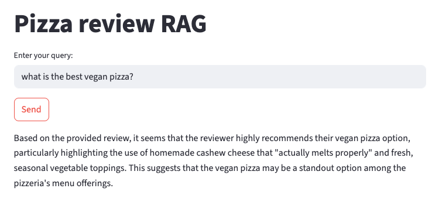

# Local RAG System with Ollama and Qdrant
Use Ollama to build a local RAG system has several benefits, especially if you're aiming for provacy, low latency and cost-efficiency in running LLMs locally.

To use Ollama is necessary install it in your own OS. Available on: [Ollama](https://ollama.com/). Take a look at the models and the tool document; the choice of model is very important, review your computing resources!

Ollama model installation:
- $ ollama pull llama3.2 # small model

Embedding model installation:
- $ ollama pull mxbai-embed-large

Keep your Ollama running (on MacOS just open the Ollama application).

`NOTE: Creates a Python virtual environment before installing dependecies!`

Dependencies:
- *uv:* $ uv sync
- *pip:* $ pip install -r requirements.txt

Start the Qdrant vector store from Docker:
- $ docker-compose up -d     # Start service
- $ docker ps                # Check if the container is running
- $ docker logs qdrant       # Visualize Qdrant logs, is also necessary to get the dashboard URL

Insert all data in the Qdrant collection:
- $ python3 main.py --retrieve-data

Then run:
- $ streamlit run main.py

You should see something like this:

    

